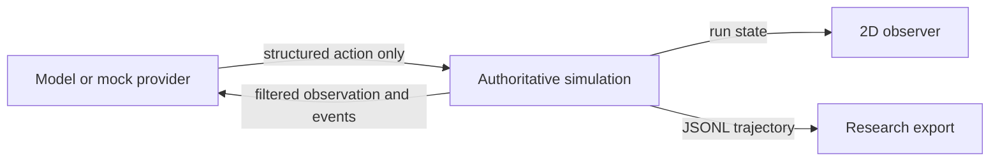

# Architecture

The engine owns reality. Provider code cannot access or mutate internal terrain, hidden items, or terminal state. `observe()` emits a bounded local view; `step()` validates every requested action; `snapshot()` is reserved for the researcher UI. Randomness derives solely from the run seed.

The V1 renderer is intentionally independent from the simulation. It consumes snapshots, so a later Rust/Bevy, Godot, or Unity renderer can use identical state transitions.

