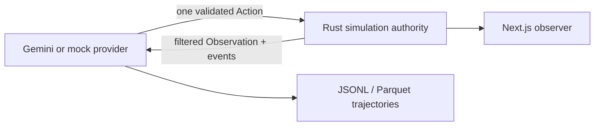

# Embodied Worlds

Embodied Worlds is a local research platform for evaluating an AI policy inside a deterministic, partially observed simulated body. A provider proposes a single structured action. The authoritative engine validates it, changes the world, emits events, and returns only the observation the body may perceive.

See [the research architecture and capability status](docs/research-architecture.md) for the authoritative system boundary, implemented capabilities, and explicit current limitations.
The current conservative capability assessment is in [research readiness](docs/research-readiness.md).



## Current V1

The Survival Room has two connected rooms, a locked exit, key locker, food, water, an electrical hazard, an NPC, seeded deterministic ambient events, a seed-dependent service-door perturbation, and resource constraints. Procedural worlds independently vary between validated two- and three-room corridor graphs. The Rust workspace contains the authoritative engine and Axum server source. The Python package provides mock providers, a Gemini adapter, compact episodic context, run orchestration, JSONL/Parquet output, and a repeatable benchmark CLI. The Next.js observer is a separate local process with a manual-control baseline.

## Prerequisites

- Python 3.12+
- Node 20+
- Rust stable plus Microsoft C++ Build Tools on Windows for the Rust server

Docker is intentionally not required for the current local setup.

## Setup

```powershell
python -m pip install -e .
npm install --prefix frontend/observer
```

Copy `.env.example` to `.env`, then set `GEMINI_API_KEY` only when using Gemini. Never commit that file.

## Run individual processes

Start all three as independent background processes, with health checks and logs under `data/local-processes/`:

```powershell
.\scripts\start-local.ps1
```

Pass `-NoBrowser` for a headless launch. The commands below remain available when you want each process in its own terminal.

Terminal 1 (authoritative Rust API):

```powershell
.\scripts\dev.ps1
```

The Rust process uses `SIM_SERVER_PORT` when it is set; otherwise it uses `8080`. Keep the observer's `NEXT_PUBLIC_SIM_SERVER_URL` and `NEXT_PUBLIC_SIM_WS_URL` aligned if you choose a different port.

Terminal 2 (Next.js observer):

```powershell
npm run dev --prefix frontend/observer
```

Terminal 3 (optional browser-to-provider control service):

```powershell
python -m embodied_ai.agent_service --server-url http://127.0.0.1:8080
```

Open `http://localhost:3000`.

The helper configures the local Windows Rust toolchain. It is the only simulation server; Python only orchestrates model decisions through the Rust HTTP API. With Terminal 3 running, choose a provider and observation mode in the observer and select **Start agent**. It returns the authoritative run ID immediately, while the provider continues independently and the Rust WebSocket streams the live simulation. Use **Start manual** for the human-control baseline.

Every browser-launched provider run writes an immutable experiment manifest before rollout. Its trajectory records carry the same experiment ID, and the completed local-run status retains the manifest path even when a provider fails before emitting trajectory steps. The observer exposes that manifest as a download beside JSONL and Parquet exports.

## Run policies and benchmarks

Generate a deterministic symbolic world without starting an episode:

```powershell
Invoke-RestMethod -Method Post http://127.0.0.1:8080/api/worlds/generate -ContentType application/json -Body '{"seed":42}'
```

For a built-in split experiment, assert the partition at generation time. Rust rejects a seed that does not belong to the requested partition:

```powershell
Invoke-RestMethod -Method Post http://127.0.0.1:8080/api/worlds/generate -ContentType application/json -Body '{"seed":9000,"partition":"test"}'
```

Start an authoritative episode directly from that generator family:

```powershell
Invoke-RestMethod -Method Post http://127.0.0.1:8080/api/runs -ContentType application/json -Body '{"generated_world":{"seed":42}}'
```

The response contains an immutable `world_manifest` with generator version, seed, hash, generation attempt, dimensions, scenario definition, and solvability validation. Default train, validation, and test seed partitions are disjoint. A procedural request may assert one of those partitions (`train`, `validation`, or `test`); custom experimental seed lists remain manifest-defined.

To ask Rust which default partition owns a seed, use `GET /api/worlds/partition/{seed}`. Seeds outside the configured distribution return `404` instead of being guessed.

```powershell
python -m embodied_ai.cli run --scenario survival_room --provider scripted --seed 42 --server-url http://127.0.0.1:8080
python -m embodied_ai.cli run --generated-world-seed 42 --provider random_valid --seed 42 --server-url http://127.0.0.1:8080
python -m embodied_ai.cli run --generated-world-seed 42 --generator-config configs/generator/compact-v1.json --provider random_valid --server-url http://127.0.0.1:8080
python -m embodied_ai.cli run --generated-world-seed 42 --generator-config configs/generator/three-room-v1.json --provider random_valid --server-url http://127.0.0.1:8080
python -m embodied_ai.cli benchmark --scenario survival_room --provider scripted --runs 20 --seed-start 1000 --server-url http://127.0.0.1:8080
python -m embodied_ai.cli benchmark-scale --provider random_valid --runs 64 --workers 1,8,32,64 --server-url http://127.0.0.1:8080
python -m embodied_ai.cli generalize --provider scripted --train-start 0 --train-count 20 --validation-start 8000 --validation-count 10 --test-start 9000 --test-count 10 --server-url http://127.0.0.1:8080
python -m embodied_ai.cli generalize --provider cautious --train-generator-config configs/generator/two-room-v1.json --validation-generator-config configs/generator/three-room-v1.json --test-generator-config configs/generator/three-room-v1.json --server-url http://127.0.0.1:8080
python -m embodied_ai.cli generalize --provider cautious --observation-mode noisy --server-url http://127.0.0.1:8080
python -m embodied_ai.cli audit-generalization --report data/exports/generalization/generalization_report.json
python -m embodied_ai.cli audit-dataset --trajectory data/runs/YOUR_RUN.jsonl
python -m embodied_ai.cli audit-experiment --manifest data/runs/YOUR_EXPERIMENT.experiment.json --trajectory data/runs/YOUR_RUN.jsonl
python -m embodied_ai.cli compare-generalization --left data/exports/experiment-a/generalization_report.json --right data/exports/experiment-b/generalization_report.json
python -m embodied_ai.cli train-tabular --episodes 100 --checkpoint data/checkpoints/tabular_q.json --server-url http://127.0.0.1:8080
python -m embodied_ai.cli evaluate-tabular --checkpoint data/checkpoints/tabular_q.json --seed-start 9000 --episodes 20 --server-url http://127.0.0.1:8080
python -m embodied_ai.cli train-tabular --observation-mode noisy --episodes 100 --checkpoint data/checkpoints/tabular_q_noisy.json --server-url http://127.0.0.1:8080
python -m embodied_ai.cli evaluate-tabular --observation-mode noisy --checkpoint data/checkpoints/tabular_q_noisy.json --seed-start 9000 --episodes 20 --server-url http://127.0.0.1:8080
python -m embodied_ai.cli train-tabular --generator-config configs/generator/two-room-v1.json --checkpoint data/checkpoints/tabular_q_two_room.json --server-url http://127.0.0.1:8080
python -m embodied_ai.cli evaluate-tabular --generator-config configs/generator/three-room-v1.json --checkpoint data/checkpoints/tabular_q_two_room.json --seed-start 9000 --episodes 20 --server-url http://127.0.0.1:8080
python -m embodied_ai.cli generalize-tabular --train-count 100 --validation-count 20 --test-count 20 --checkpoint data/checkpoints/tabular_q_generalization.json --output data/exports/tabular-generalization --server-url http://127.0.0.1:8080
python -m embodied_ai.cli run --provider gemini --max-wall-seconds 300 --max-total-tokens 20000 --server-url http://127.0.0.1:8080
python -m embodied_ai.cli run --provider cautious --observation-mode noisy --server-url http://127.0.0.1:8080
python -m embodied_ai.cli run --provider cautious --policy-state-mode preserve --server-url http://127.0.0.1:8080
python -m embodied_ai.cli run --provider cautious --resume-run-id YOUR_LIVE_RUN_ID --server-url http://127.0.0.1:8080
python -m embodied_ai.cli run --provider cautious --restore-replay-id YOUR_PERSISTED_REPLAY_ID --server-url http://127.0.0.1:8080
```

Start the Rust server before either command. Rust events are persisted as replayable JSONL plus a structured replay record (including initial and per-step researcher snapshots and the exact filtered observations supplied to the agent) under `data/runs/`; the observer library loads those saved replays after a server restart and supports step/playback controls. Its decision panel shows bounded policy telemetry when supplied, never private reasoning or hidden world state. The Python run and benchmark commands also export step-level Rust observations, decisions, events and metrics as JSONL/Parquet.

`generalize` creates only procedural worlds, keeps its three seed sets disjoint, and writes `generalization_report.json` plus per-episode JSONL. Its defaults match Rust's declared train (`0..7999`), validation (`8000..8999`), and test (`9000..9999`) partitions; explicit ranges remain available for a separately documented experimental split. `--generator-config` applies one config to every split. Alternatively, the three per-partition config flags record a distinct train/validation/test layout or hazard-rule distribution, for example a two-room/electrical training family versus three-room/fire held-out worlds. Each episode records the actual generated hazard kinds, room count, and joint mechanics signature from the Rust world manifest; each split summary stratifies outcomes by hazard family, room topology, and their joint composition, with a Wilson 95% interval for every binary-success slice. `--observation-mode` is persisted in the report, every episode row, and the experiment manifest; compare policies only within a matching sensor mode. Its report includes each split's config, success rate with a Wilson 95% interval, reward, episode length, invalid-action rate, exploration/resource metrics, failure reasons, steps/sec, and train-to-held-out gaps. It evaluates policies; it does not train them.

`compare-generalization` compares split metrics, held-out gaps, hazard-kind success rates, room-topology success rates, and joint mechanics success rates only after verifying complete provenance: report and engine versions, sensor mode, seed distribution, generator configuration, and (when present) every episode row against its declared split and summary. It rejects missing or incompatible metadata instead of producing misleading deltas.

`audit-generalization` performs that provenance check on one report and emits a compact receipt containing its experimental conditions, canonical generator-config fingerprints, split counts, and whether episode-level evidence was checked. It is local and read-only; use it before comparing, archiving, or sharing a report.

`audit-experiment` is the corresponding local, read-only check for one immutable experiment manifest. It first verifies the persisted fingerprint, then, when given a JSONL trajectory, requires every row to carry the same experiment ID, observation mode, generated-world manifest, and configured policy-state mode. It rejects mixed run IDs or altered provenance instead of treating nearby-looking artifacts as one experiment.

Benchmark summaries report control wall-clock measurements and mean episode-initialization latency separately from `simulation_steps_per_second`, which is derived from the Rust server's authoritative per-step simulation timings. Initialization latency is local Rust HTTP/create overhead, not a simulator-throughput claim; provider/model latency is likewise not presented as simulator throughput.

`scripted`, `mock_reasoning`, and `random_valid` require no API key. The Gemini adapter uses the official `google-genai` SDK, structured JSON output, timeouts and post-response Pydantic validation; it is intentionally opt-in.

`train-tabular` is a small infrastructure-validation RL baseline. It learns a tabular Q-function from the selected public observation mode, submits every action to Rust, and saves a reloadable JSON checkpoint. It proposes open/pickup actions only for locally reachable public entities and `use_item` only for public carried-item IDs. Train and evaluation each persist an immutable experiment manifest beside that checkpoint, recording the observation mode, procedural generator config, seed start, episode count, and tabular hyperparameters where applicable. Use matching `--observation-mode` and `--generator-config` values for straightforward train/test comparisons; intentionally different values are perception/layout-shift experiments and should be labeled as such. It is intentionally not a claim of competitive agent performance.

Custom policies can use the headless adapter directly. `distribution` is a named Rust-generated-world partition; it is not a Python-side scenario selector. `world_partition` remains a compatible alias for existing callers.

```python
from embodied_ai.environment import EmbodiedEnv, EmbodiedEnvConfig

with EmbodiedEnv(distribution="train", observation_mode="normal") as env:
    observation, info = env.reset(seed=123)
    while True:
        observation, reward, terminated, truncated, info = env.step(policy.act(observation))
        if terminated or truncated:
            break
```

`generalize-tabular` trains once on an explicit procedural train split, freezes the checkpoint, then evaluates that same policy over train, validation, and test splits. It writes an immutable manifest, per-episode JSONL, and a held-out-gap report with authoritative invalid-action, exploration, resource-efficiency, and local rollout-throughput metrics. It is a lifecycle and generalization measurement tool, not a performance claim.

If an in-run provider call exhausts its retries, the runner marks the authoritative run as `provider_error`, persists the partial replay, and returns a clean terminal result instead of leaving an active run behind.

With `GEMINI_API_KEY` set in `.env`, run Gemini against the Rust authority with:

```powershell
python -m embodied_ai.cli run --provider gemini --server-url http://127.0.0.1:8080
```

Pass `--model <Gemini model name>` to override `GEMINI_MODEL`, `--max-steps <positive integer>` to create an authoritative run with a shorter timeout, or `--observation-mode minimal|normal|rich|noisy|oracle` for a reproducible perception ablation. `normal` is local symbolic perception, `noisy` applies deterministic 20% local-cell dropout, and `oracle` exposes the full symbolic map only as an explicitly labeled research baseline. Oracle results must not be compared as restricted-perception agent performance.

## Verify

```powershell
.\scripts\test_all.ps1
.\scripts\validate-scenario.ps1
```

Run the complete no-Docker smoke test (it starts and stops a temporary Rust process, executes the scripted Python policy, then validates the persisted events and replay):

```powershell
.\scripts\smoke_test.ps1
```

Benchmark the Rust core directly (no browser, server, or model call):

```powershell
.\scripts\use-rust-env.ps1
Push-Location rust
cargo bench -p sim-core
Pop-Location
```

## Known limitations

For a real-browser smoke test, start the three local processes, then run:

```powershell
.\scripts\browser-smoke.ps1
```

This uses pinned `agent-browser` tooling through npm and your installed Chrome (override `-BrowserPath` if needed). It creates a two-step manual run, checks live state, filters, read-only replay navigation, light theme, mobile overflow, and page errors. Screenshots are saved under `data/browser-smoke/`. No browser binary is downloaded and existing browser profiles are not used.

PostgreSQL metadata and full Rust/Python schema parity are not complete yet. The current local workflow deliberately uses individual Rust, Python, and Next.js processes; replay and JSONL persistence remain available without a database service. The Rust server discovers canonical `scenario.rust.json` files beneath `scenarios/` (or `SIM_SCENARIO_DIR`) and accepts `scenario_id` at run creation. These limitations are documented rather than masked with fake success claims.

See [ARCHITECTURE.md](ARCHITECTURE.md), [RESEARCH.md](RESEARCH.md), [scenario authoring](docs/scenario-authoring.md), and [benchmarking](docs/benchmarking.md).
